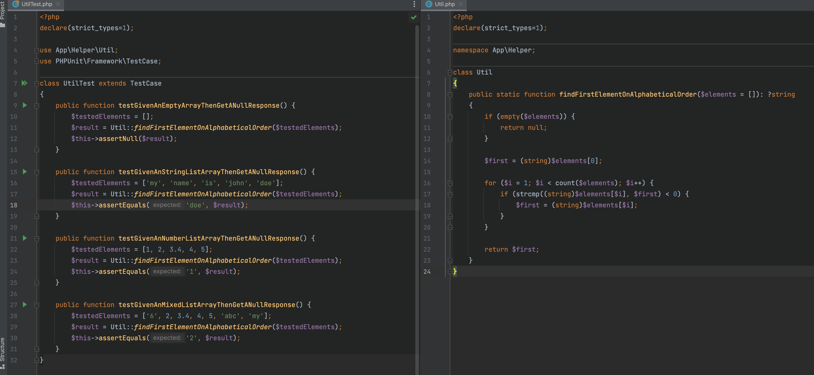
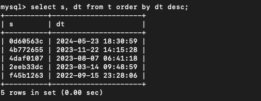
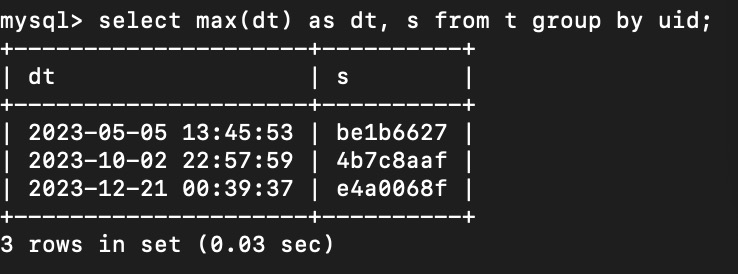

## Assignment 1

Find the first element in alphabetical order for an array of strings using a loop. For example, for this array: $a=['my','name','is','john','doe']; the result should be 'doe'. Please write your answer in PHP 8



Install project with composer

``
composer insttall
``

Test different cases with unit test
- [x] Test with empty array and return null
- [x] Test with list of string and return the first element based on alphabetical order
- [x] Test with list of number and return the first element based on alphabetical order
- [x] Test with list of mixed elements and return the first element based on alphabetical order

``
vendor/phpunit/phpunit/phpunit tests/Helper/UtilTest.php
``


## Assignment 2

There is a `t` table with 3 fields:
`uid` - user ID
`dt` - date and time of message
`s` - text of the message.
Each message gets its own row in the database.
Write an SQL query to retrieve date and text of the last message for all users.


### Condition 1: If t has only 3 columns and user id is PK

Create table

````
CREATE TABLE t (
uid bigint(20) unsigned NOT NULL AUTO_INCREMENT,
dt DATETIME,
s varchar(255),
PRIMARY KEY (uid)
);
````

Insert into some dump data with random text and datetime

````
insert into t values (null, FROM_UNIXTIME(UNIX_TIMESTAMP('2022-09-01 00:00:00') + FLOOR(0 + (RAND() * 63072000))), LEFT(MD5(RAND()), 8));
insert into t values (null, FROM_UNIXTIME(UNIX_TIMESTAMP('2022-09-01 00:00:00') + FLOOR(0 + (RAND() * 63072000))), LEFT(MD5(RAND()), 8));
insert into t values (null, FROM_UNIXTIME(UNIX_TIMESTAMP('2022-09-01 00:00:00') + FLOOR(0 + (RAND() * 63072000))), LEFT(MD5(RAND()), 8));
insert into t values (null, FROM_UNIXTIME(UNIX_TIMESTAMP('2022-09-01 00:00:00') + FLOOR(0 + (RAND() * 63072000))), LEFT(MD5(RAND()), 8));
insert into t values (null, FROM_UNIXTIME(UNIX_TIMESTAMP('2022-09-01 00:00:00') + FLOOR(0 + (RAND() * 63072000))), LEFT(MD5(RAND()), 8));
````

Query to retrieve date and text of the last message for all users.

````

select s, dt from t order by dt desc;

````

Result will be similar



### Condition 2: If t has an autoincrement id with 3 columns

Create table

````
CREATE TABLE t (
id bigint(20) unsigned NOT NULL AUTO_INCREMENT,
uid bigint(20) unsigned NOT NULL,
dt DATETIME,
s varchar(255),
PRIMARY KEY (id)
);
````

Insert into some dump data with random text and datetime

````
insert into t values (null, 1, FROM_UNIXTIME(UNIX_TIMESTAMP('2022-09-01 00:00:00') + FLOOR(0 + (RAND() * 63072000))), LEFT(MD5(RAND()), 8));
insert into t values (null, 1, FROM_UNIXTIME(UNIX_TIMESTAMP('2022-09-01 00:00:00') + FLOOR(0 + (RAND() * 63072000))), LEFT(MD5(RAND()), 8));
insert into t values (null, 2, FROM_UNIXTIME(UNIX_TIMESTAMP('2022-09-01 00:00:00') + FLOOR(0 + (RAND() * 63072000))), LEFT(MD5(RAND()), 8));
insert into t values (null, 2, FROM_UNIXTIME(UNIX_TIMESTAMP('2022-09-01 00:00:00') + FLOOR(0 + (RAND() * 63072000))), LEFT(MD5(RAND()), 8));
insert into t values (null, 3, FROM_UNIXTIME(UNIX_TIMESTAMP('2022-09-01 00:00:00') + FLOOR(0 + (RAND() * 63072000))), LEFT(MD5(RAND()), 8));
````

Query to retrieve date and text of the last message for all users.

````
select uid, max(dt) as dt, s from t group by uid;
````

Result will be similar




## Assignment 3

A business has two types of users: staff and clients. Staff members can perform actions to help run the business while clients interact with the business by buying products and services. The two types of users aren't completely different however, they both have logins and profiles. Describe in words (no source code) what classes you'd create to model users for this business and any relationships between classes (no need for properties or methods).


### Option 1: Use Inheritance 

We can create a super class to hold all common properties of staff and clients as well as common functions like login, logout, etc.
In sub class Client, it has own functions to buy products and in sub class Staff, it has own functions to handle service.

Pros: command properties and functions are handled in super class
Cons: php supports one class extension. If staff login and client login are different logic then it's not a proper way

````
abstract class User {
    public function login();
    public function logout();
}

class Client extends User {
    public buyProducts();
}

class Staff extends User {
    public performActions();
}
````


### Option 2: Use Interface 

We can create an inteface to hold all common functions of staff and clients like login, logout, etc.
In class Client, it has implemented functions like login, logout, and has own function to buy products.
In class Staff, it has implemented functions like login, logout, and has own function to perform service.

Pros: php support multiple interface implementations, and staff and client may easily have different common function logic like login
Cons: Client and Staff may have duplicate common logic using interface


````
interface User {
    function login();
    function logout();
}

class Client implments User {
    public function login();
    public function logout();
    public buyProducts();
}

class Staff implments User {
    public function login();
    public function logout();
    public performActions();
}
````